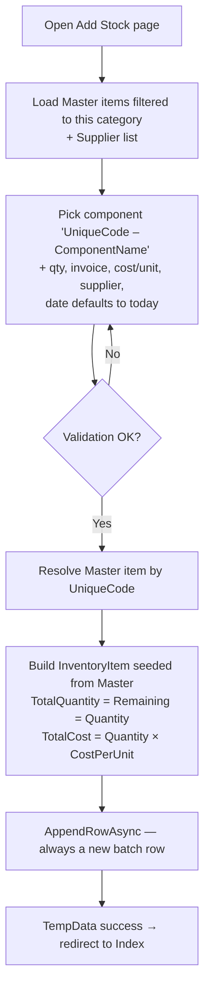
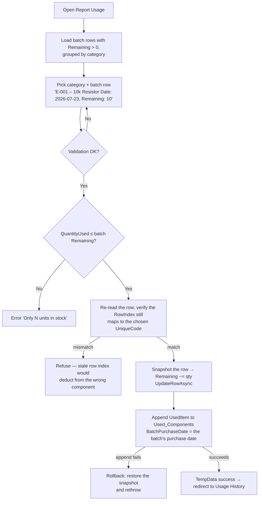
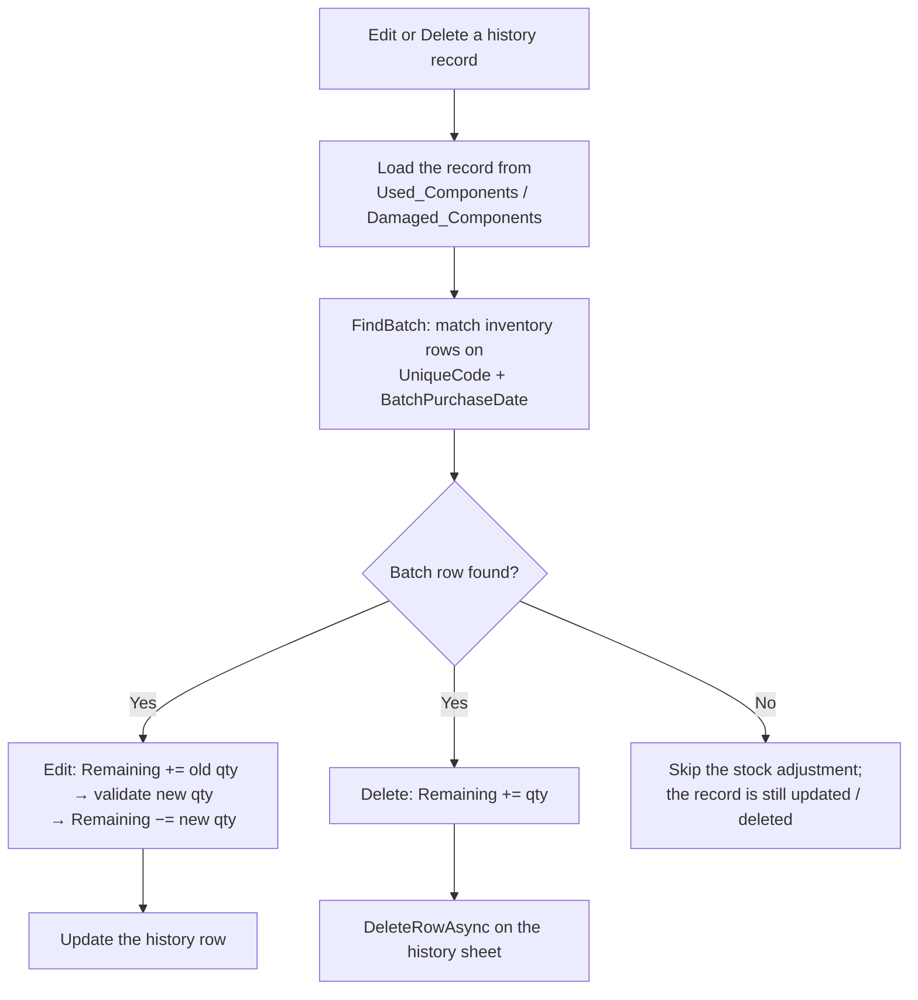
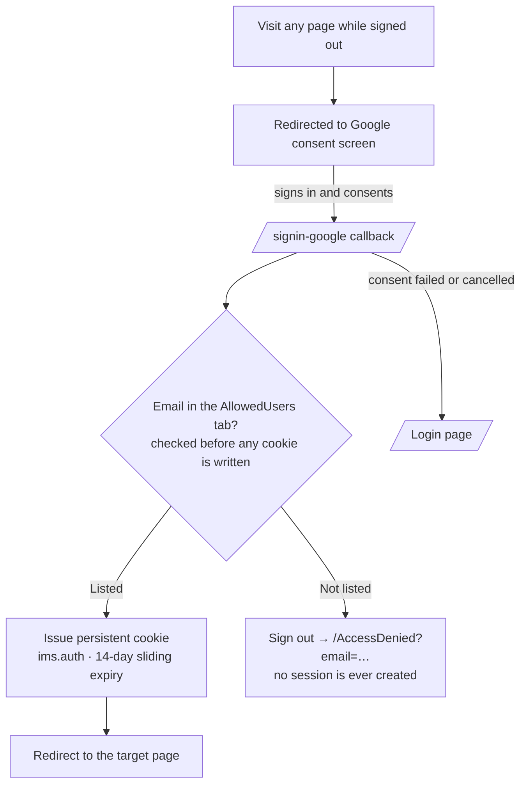

<div align="center">

<!-- Drop the I2ST logo or a screenshot of the app here, e.g.:
     
     
-->

# IMS — Inventory Management System

*Internal inventory tracking for I2ST Technologies Pvt. Ltd.*

**Track stock in, stock out and damage — with a Google Spreadsheet as the live database.**

**Version 2.3** &nbsp;·&nbsp; ASP.NET Core Razor Pages (.NET 10) &nbsp;·&nbsp; Google Sheets API v4 &nbsp;·&nbsp; Google Cloud Run

[](https://dotnet.microsoft.com)
[](https://learn.microsoft.com/aspnet/core/razor-pages)
[](https://developers.google.com/sheets/api)
[](https://cloud.google.com/run)
[](https://developers.google.com/identity/protocols/oauth2)
[](https://getbootstrap.com)

</div>

---

## Table of Contents

1. [Overview](#1-overview)
2. [Architecture & Flow Charts](#2-architecture--flow-charts)
3. [Google Sheets — the Live Database](#3-google-sheets--the-live-database)
4. [How the Application Works — Module by Module](#4-how-the-application-works--module-by-module)
5. [Core Business Rules & Invariants](#5-core-business-rules--invariants)
6. [Conventions & Technical Rules](#6-conventions--technical-rules)
7. [Project Structure](#7-project-structure)
8. [Getting Started](#8-getting-started)
9. [Deployment — Google Cloud Run](#9-deployment--google-cloud-run)
10. [Version History](#10-version-history)

---

## 1. Overview

The **Inventory Management System (IMS)** is a production web application used
internally by **I2ST Technologies Pvt. Ltd.** to manage the electronics,
electrical components, tools and modules the company works with. It is a
*read/write* application — there is no sales or billing; it tracks:

- **Stock in** — purchases, stored as **batches** with per-batch cost, invoice,
  supplier and purchase date, enabling accurate historical cost analysis.
- **Stock out** — component **usage** and **damage**, reported against a
  specific batch.
- **Visibility** — remaining quantities per batch, batch-level cost tracking,
  and low-stock alerts.

The application has **no traditional SQL database**. A **Google Spreadsheet is
the live data store**, accessed through the **Google Sheets API v4**. The
server-side application reads raw cells, parses them into typed C# models,
performs all business logic (stock maths, validation, compensating rollback)
in memory, and writes changes back to the spreadsheet.

This design was chosen deliberately: it costs nothing to host at low scale,
needs no database administration, and lets authorised staff inspect or export
the raw data directly in Google Sheets.

Access is restricted at the application level: users sign in with **Google
OAuth 2.0**, and only Google accounts listed in the spreadsheet's
`AllowedUsers` tab can use the application. The app deploys to **Google Cloud
Run** and scales to zero.

---

## 2. Architecture & Flow Charts

### 2.1 High-Level Architecture

```mermaid
flowchart LR
    User[Browser] -->|HTTPS| LB[Google Cloud Load Balancer<br/>(terminates TLS)]
    LB -->|Plain HTTP + X-Forwarded headers| CR[Cloud Run<br/>ASP.NET Core instance]
    CR -->|HTTPS + OAuth2 token| SHEETS[Google Sheets API v4]
    SHEETS -->|Spreadsheet ID| SP[(Google Spreadsheet<br/>the live database)]
    SP -->|tabs| T1[Master]
    SP -->|tabs| T2[Suppliers]
    SP -->|tabs| T3[Electronics_Inventory]
    SP -->|tabs| T4[Electrical_Inventory]
    SP -->|tabs| T5[Tools_Inventory]
    SP -->|tabs| T6[Modules_Inventory]
    SP -->|tabs| T7[Used_Components]
    SP -->|tabs| T8[Damaged_Components]
    SP -->|tabs| T9[AllowedUsers]
    SA[Service account / ADC] -.->|machine credential| CR
    SA -.->|shares the spreadsheet as Editor| SP
```

**The request lifecycle:**

1. The browser calls a page URL. Cloud Run's load balancer terminates TLS and
   forwards the request with `X-Forwarded-*` headers; the app trusts them
   (`UseForwardedHeaders`) so scheme-aware redirects work in production.
2. Authentication middleware verifies the session cookie — an unauthenticated
   request is challenged to Google's consent screen.
3. Razor Pages routing dispatches to the page model (`.cshtml.cs`), which
   constructor-injects the singleton `GoogleSheetsService`.
4. The page model calls `GetRowsAsync(sheetName)` → the service builds a
   signed OAuth2 request → the Sheets API returns raw cells → the page model
   parses rows into typed models (`MasterItem`, `InventoryItem`, …).
5. The page model applies business logic (sorting, stock maths, validation)
   and re-renders the Razor view, or performs a write
   (`AppendRowAsync` / `UpdateRowAsync` / `DeleteRowAsync`) — serialised
   through a `SemaphoreSlim` lock — and redirects with a success message.

### 2.2 Page / Navigation Map

```
Home · Inventory ▾ (Electronics, Electrical, Tools, Modules)
     · Transactions ▾ (Report Usage, Usage History | Report Damage, Damage History)
     · Master · Suppliers · Reports        [right:] Settings · Sign out
```



```mermaid
flowchart TD
    HOME[Home / Dashboard] --> MASTER[Master List]
    HOME --> SUP[Suppliers]
    HOME --> ELEC[Electronics Inventory]
    HOME --> ELCT[Electrical Inventory]
    HOME --> TOOLS[Tools Inventory]
    HOME --> MODS[Modules Inventory]
    HOME --> UR[Report Usage]
    HOME --> DR[Report Damage]
    HOME --> REP[Reports / CSV + ZIP]
    HOME --> SET[Settings]

    MASTER --> M_CREATE[Create Master Item]
    MASTER --> M_EDIT[Edit Master Item]
    MASTER --> M_DEL[Delete Master Item]

    ELEC --> E_ADD[Add Stock – Electronics]
    ELEC --> E_EDIT[Edit Batch]
    ELEC --> E_DEL[Delete Batch]
    ELCT --> EL_ADD[Add Stock – Electrical]
    ELCT --> EL_EDIT[Edit Batch]
    ELCT --> EL_DEL[Delete Batch]
    TOOLS --> T_ADD[Add Stock – Tools]
    TOOLS --> T_EDIT[Edit Batch]
    TOOLS --> T_DEL[Delete Batch]
    MODS --> MO_ADD[Add Stock – Modules]
    MODS --> MO_EDIT[Edit Batch]
    MODS --> MO_DEL[Delete Batch]

    UR --> UH[Usage History]
    UH --> UE[Edit Usage Record]
    UH --> UD[Delete Usage Record]

    DR --> DH[Damage History]
    DH --> DE[Edit Damage Record]
    DH --> DD[Delete Damage Record]
```

*Note: the four category inventory folders are structurally identical — same
pages, same logic, only the sheet name differs.*

### 2.3 Business Flow — Add Stock (batch append)

Every purchase is appended as a **new batch row** — multiple rows may share a
UniqueCode. Nothing is ever overwritten.



### 2.4 Business Flow — Report Usage (batch deduction with rollback)

Usage and damage are reported against a **specific batch row**, not against a
component as a whole.



**Report Damage** is identical, except it writes to `Damaged_Components` with
two extra optional fields (Invoice No., Cost per Unit — each falling back to
the batch row's value when blank) and checks `QuantityDamaged` instead.

### 2.5 Business Flow — History Edit / Delete (stock reversal)

Log rows carry no pointer to an inventory row, only UniqueCode and
BatchPurchaseDate, so the batch is located by matching **both**.



---

## 3. Google Sheets — the Live Database

One spreadsheet, **nine tabs**. **Header row is row 1** in every tab; all
columns are in the exact order below. Cells are read as raw objects (numbers
come back as `double`, trailing empty cells are omitted) — every parse goes
through safe helpers (`SheetCell.SafeInt`, `SheetCell.SafeDecimal`,
invariant culture). Row indexes in code are **1-based and include the header**,
and that index is the entity ID in URLs.

| # | Tab | Columns |
|---|---|---|
| 1 | `Master` | UniqueCode, ComponentName, Category, Brand, Description, Unit, MinStockAlert |
| 2 | `Suppliers` | SupplierName, ContactInfo |
| 3 | `Electronics_Inventory` | UniqueCode, ComponentName, Brand, TotalQuantity, Remaining, InvoiceNo, CostPerUnit, TotalCost, Supplier, DateOfPurchase, Remarks |
| 4 | `Electrical_Inventory` | same 11-column layout as #3 |
| 5 | `Tools_Inventory` | same 11-column layout as #3 |
| 6 | `Modules_Inventory` | same 11-column layout as #3 |
| 7 | `Used_Components` | UniqueCode, ComponentName, Category, BatchPurchaseDate, UsedDate, QuantityUsed, Remarks |
| 8 | `Damaged_Components` | UniqueCode, ComponentName, Category, BatchPurchaseDate, DamageDate, QuantityDamaged, InvoiceNo, CostPerUnit, Remarks |
| 9 | `AllowedUsers` | Email — access control allow-list |

### 3.1 `Master` — the central catalogue (7 columns)

| Col | Name | Notes |
|---|---|---|
| A | UniqueCode | Auto-generated: `E-001`, `EL-014`, `T-003`, `M-002` |
| B | ComponentName | Primary identifier |
| C | Category | `Electronics` / `Electrical` / `Tools` / `Modules` |
| D | Brand | Optional |
| E | Description | Optional |
| F | Unit | e.g. `pcs`, `meters`, `sets` |
| G | MinStockAlert | Low-stock threshold (default 5) |

### 3.2 `Suppliers` (2 columns)

| Col | Name | Notes |
|---|---|---|
| A | SupplierName | Sorted alphabetically |
| B | ContactInfo | Optional |

### 3.3 Category inventory tabs (11 columns each)

`Electronics_Inventory`, `Electrical_Inventory`, `Tools_Inventory`,
`Modules_Inventory` — identical layout, served by one C# model
(`InventoryItem`). The sheet name is the only thing that differs.

| Col | Name | Notes |
|---|---|---|
| A | UniqueCode | FK → Master |
| B | ComponentName | From Master, display-only on edit |
| C | Brand | From Master |
| D | TotalQuantity | This batch's lifetime intake — never decremented |
| E | Remaining | Current stock in this batch |
| F | InvoiceNo | |
| G | CostPerUnit | Tax-inclusive (₹) |
| H | TotalCost | = TotalQuantity × CostPerUnit, rounded to 2 dp |
| I | Supplier | Picked from the Suppliers sheet |
| J | DateOfPurchase | `yyyy-MM-dd` |
| K | Remarks | |

**Multiple rows may share a UniqueCode — each row is one purchase batch.**

### 3.4 `Used_Components` — usage log (7 columns)

| Col | Name |
|---|---|
| A | UniqueCode |
| B | ComponentName |
| C | Category |
| D | BatchPurchaseDate |
| E | UsedDate |
| F | QuantityUsed |
| G | Remarks |

### 3.5 `Damaged_Components` — damage log (9 columns)

| Col | Name |
|---|---|
| A | UniqueCode |
| B | ComponentName |
| C | Category |
| D | BatchPurchaseDate |
| E | DamageDate |
| F | QuantityDamaged |
| G | InvoiceNo |
| H | CostPerUnit |
| I | Remarks |

### 3.6 `AllowedUsers` — access control (1 column)

| Col | Name |
|---|---|
| A | Email |

Only the Google accounts listed here may sign in. A missing or unreadable tab
**denies everyone** — the allow-list fails closed.

---

## 4. How the Application Works — Module by Module

### 4.1 Authentication & Access Control



- **Default scheme = cookie, challenge scheme = Google** — an unauthenticated
  visit goes straight to Google's consent screen.
- The allow-list check runs in `OnTicketReceived`, **before** the cookie is
  written, so an unlisted Google account never holds a session.
- Cookie: name `ims.auth`, HttpOnly, SameSite=Lax, persistent, 14-day
  **sliding** expiry.
- Every Razor Page is protected by a fallback authorization policy;
  `[AllowAnonymous]` on `Login`, `AccessDenied`, `Logout` and `Error`.
- `AccessControlService` caches the allowed set for **2 minutes** and fails
  closed — an API error or missing tab denies everyone.
- **The app refuses to start unconfigured**: `Program.cs` throws if
  `SpreadsheetId`, `ClientId` or `ClientSecret` is missing, so it can never
  serve the inventory unprotected.

### 4.2 Dashboard (`/`)

Loads the Master sheet and all four category sheets **in parallel**, each in
its own try/catch so a failing tab degrades to an empty list and the dashboard
never crashes. It renders five cards:

- **Master** — items in the catalogue.
- One card per category — the number of distinct **components**, with the
  batch-row count and total remaining units beneath it.

(The old "Low Stock" dashboard card was replaced in v2.2 by row highlighting
on the category pages — see 4.5.)

### 4.3 Master Catalogue (`/Master/*`)

- **Index** — all rows as `MasterItem`, sorted by **UniqueCode ascending**
  (natural order). Table shows code, name, category, brand, min stock alert,
  Edit/Delete actions.
- **Create** — ComponentName (required), Category (dropdown, required),
  Brand, Unit, MinStockAlert (default 5), Description. The **UniqueCode is
  generated server-side**: the category maps to a prefix (`E-`/`EL-`/`T-`/`M-`),
  the Master sheet is scanned for the highest numeric suffix already used with
  that prefix, and the new code is `prefix + (max + 1)` zero-padded to three
  digits (`E-001`, …).
- **Edit** — UniqueCode is **read-only**: it is the join key to every other
  sheet and cannot change.
- **Delete** — confirmation page, then physical row deletion (no cascade).

### 4.4 Suppliers (`/Suppliers/*`)

Plain CRUD against the `Suppliers` sheet, sorted alphabetically by
SupplierName. Used everywhere a supplier dropdown appears (Add Stock, Edit).
Supplier names are denormalised text, so renames do not propagate to existing
inventory rows.

### 4.5 Category Inventory (`/ElectronicsInventory/*` … `/ModulesInventory/*`)

Each folder has four pages; the four folders differ **only** in sheet name:

- **Index** — rows as `List<InventoryItem>`, sorted **UniqueCode ascending,
  then DateOfPurchase ascending** so a new batch lands directly beneath the
  earlier batches of the same component.
- **Add Stock** — the component dropdown is populated from the **Master sheet
  filtered to this category**, shown as `UniqueCode – ComponentName`
  (required), plus quantity (≥ 1), invoice no., **cost per unit (required,
  > 0)**, supplier, date of purchase (defaults to today) and remarks.
  **The submission always appends a new row** — see flow 2.3. Each row is a
  batch; no upsert, no overwrite.
- **Edit** — UniqueCode, ComponentName and Brand are display-only;
  TotalQuantity, Remaining, InvoiceNo, CostPerUnit, Supplier, DateOfPurchase
  and Remarks are editable. On save, `TotalCost = TotalQuantity ×
  CostPerUnit` is recalculated server-side. `Remaining` stays hand-editable as
  the stock-correction escape hatch.
- **Delete** — confirmation page, physical batch-row deletion.

**Low-stock highlighting.** Rows carry a `low-stock` CSS class plus a badge
when the component's **combined remaining across all batches** falls below its
Master `MinStockAlert` threshold (default 5). The comparison uses the total,
not the individual row — otherwise every nearly-exhausted batch would light up
even when a full batch sits beneath it. The alert appears right where stock is
managed, not buried in a dashboard number.

### 4.6 Report Usage (`/Usage/Report`) & Report Damage (`/Damage/Report`)

- Category dropdown; the view renders **one select per category** listing
  **individual batch rows** with `Remaining > 0`, labelled
  `E-001 – 10k Resistor (Date: 2026-07-23, Remaining: 10)`.
- Options are ordered UniqueCode ascending then DateOfPurchase ascending, so
  taking the first match consumes **oldest stock first**.
- The option value is **`rowIndex|uniqueCode`**. The RowIndex drives the
  deduction; the code is re-checked against the row found after a fresh read,
  because a stale index can point at a different component after rows above it
  are deleted — on mismatch the submission is refused with an explanation.
- **Server-side sequence** (see flow 2.4): validate category → resolve batch →
  reject if quantity > that batch's Remaining → snapshot the row → decrement
  and write → append the log row with `BatchPurchaseDate = DateOfPurchase` →
  **on append failure, restore the snapshot (compensating rollback)**.
- Damage additionally captures InvoiceNo and CostPerUnit, each falling back to
  the batch row's value when blank.
- `TotalQuantity` is **never** decremented — it is lifetime intake.

### 4.7 Usage / Damage History (`/Usage/History`, `/Damage/History` + Edit/Delete)

- Sorted **UniqueCode ascending, then date descending**.
- **HistoryEdit** — quantity, date and remarks are editable; code, name,
  category and batch date are read-only. If the quantity changed: the old
  quantity is added back to the batch's Remaining, the new quantity is
  validated against the restored figure and deducted, then the log row is
  updated. If the batch row is gone, the adjustment is skipped but the record
  is still saved.
- **HistoryDelete** — adds the quantity back to the batch, then removes the
  log row.
- Both locate the batch with `FindBatch(rows, code, batchPurchaseDate)` —
  matching on both fields, falling back to the first row with the same code
  when the original batch row has been deleted.

### 4.8 Reports (`/Reports`)

Eight live downloads (Master, four category inventories, Suppliers, Usage,
Damage) plus **Download All (ZIP)** — `?handler=Csv&key=…` and
`?handler=Zip`.

- Every download reads the sheet **live**; nothing is cached or precomputed.
- Ragged rows (the Sheets API drops trailing empty cells) are padded to the
  widest row so columns stay aligned.
- Fields are quoted only when they contain a comma, quote, newline or edge
  whitespace; embedded quotes are doubled.
- **UTF-8 with BOM** — without it, Excel mangles `₹` and other non-ASCII text.
- The `key` parameter resolves through an allow-list, so the handler cannot be
  pointed at an arbitrary tab.
- In the ZIP a missing tab is skipped rather than failing the archive.
- Filenames: `<SheetName>_<yyyy-MM-dd>.csv`, archive
  `InventoryReports_<date>.zip`.

### 4.9 Settings (`/Settings`)

Account name and email from the Google profile claims, sign-out (a POST form,
so a stray link or prefetch cannot end a session), and a **light/dark theme
switcher** with a live preview. The theme is stored in `localStorage` and
mirrored to a cookie, then applied by an inline `<head>` script before first
paint — no flash of the wrong theme on load. Implemented with Bootstrap 5.3's
`data-bs-theme`; the navbar stays dark in both themes.

---

## 5. Core Business Rules & Invariants

1. **Row indexes are 1-based and include the header**; `RowIndex` is the URL
   id. A row at list position `i` lives at sheet row `i + 1`.
2. **UniqueCode is immutable** once created and is the join key across Master,
   the four category tabs, the usage log and the damage log.
3. **Costs are tax-inclusive** (₹, no GST columns).
   `TotalCost = Round(TotalQuantity × CostPerUnit, 2)` is computed
   server-side, never accepted from a form.
4. **Physical rows are append-only.** Add Stock always appends a batch row; all
   ordering happens in LINQ within the page models — never in the service,
   never in the sheet.
5. **Deletes never renumber** — deletion is a physical row removal; UniqueCode
   is an identifier, not a sequence number.
6. **Every write is serialised** through `GoogleSheetsService._writeLock`
   (a `SemaphoreSlim`), so concurrent requests cannot interleave on the
   spreadsheet.
7. **Stock deductions are rollback-protected** — a usage/damage log append
   failure restores the original row snapshot.
8. **History edits/deletes reverse stock transactionally** — the original
   quantity is added back before the new quantity is deducted (edit) or the
   record is removed (delete).
9. **Low-stock compares totals across batches**, not individual rows, against
   the Master threshold (fallback 5).
10. **Money is `decimal`**, parsed and formatted with `InvariantCulture`,
    displayed as `₹ N2`. **Dates are plain `yyyy-MM-dd` strings**, never typed
    dates; date inputs default to today.

---

## 6. Conventions & Technical Rules

- **Sheet names (exact):** `Master`, `Suppliers`, `Electronics_Inventory`,
  `Electrical_Inventory`, `Tools_Inventory`, `Modules_Inventory`,
  `Used_Components`, `Damaged_Components`, `AllowedUsers`. The legacy tabs
  (`PCB_Inventory`, `Panel_Inventory`, `Damages_Components`) are gone.
- **UniqueCode prefixes:** `E-` Electronics, `EL-` Electrical, `T-` Tools,
  `M-` Modules; numeric suffix zero-padded to 3 digits.
- **Category → tab mapping** lives in two static methods on `InventoryItem` —
  `SheetNameFor(category)` and `CodePrefixFor(category)` — so a future fifth
  category is a two-line change plus a new tab.
- **Sorting rules:** Master and category tabs by UniqueCode ascending (natural
  order, `UniqueCodeComparer`); category tabs secondarily by DateOfPurchase
  ascending; history by UniqueCode ascending then date descending; Suppliers
  alphabetically by name.
- **Nullable reference types and implicit usings are enabled**; the project
  targets `net10.0`.
- **`GoogleSheetsService` is the only class allowed to touch the Sheets API**;
  page models never build Sheets requests themselves.
- The project builds clean: **0 errors, 2 warnings** (both pre-existing:
  an obsolete `ForwardedHeadersOptions.KnownNetworks` and an obsolete
  `GoogleCredential.FromFile` overload).

---

## 7. Project Structure

```
Inventory_MS/
├─ Inventory_MS.csproj          .NET 10, nullable + implicit usings
├─ Program.cs                   Startup, auth, DI, Cloud Run binding
├─ appsettings.json             Config placeholders (secrets via env vars)
├─ Models/
│  ├─ AllowedUser.cs            Access control model
│  ├─ DamagedItem.cs            Damage log row
│  ├─ InventoryItem.cs          Category inventory row (all four tabs)
│  ├─ MasterItem.cs             Master catalogue row
│  ├─ SheetCell.cs              Safe cell-parsing helpers
│  ├─ Supplier.cs               Supplier row
│  ├─ UniqueCodeComparer.cs     Natural-order code sorting
│  └─ UsedItem.cs               Usage log row
├─ Services/
│  ├─ AccessControlService.cs   AllowedUsers lookup (cached, fail-closed)
│  ├─ GoogleSheetsService.cs    All Sheets API calls (singleton, write lock)
│  └─ StockAlerts.cs            Low-stock threshold logic
├─ Pages/
│  ├─ Index                     Dashboard
│  ├─ Login / AccessDenied / Logout
│  ├─ Reports                   CSV / ZIP export
│  ├─ Settings                  Account, theme, preferences
│  ├─ Master/ · Suppliers/      CRUD
│  ├─ {Electronics|Electrical|Tools|Modules}Inventory/
│  │                            Index, AddStock, Edit, Delete
│  ├─ Usage/ · Damage/          Report, History, HistoryEdit, HistoryDelete
│  └─ Shared/                   Layouts, partials, theme head
└─ wwwroot/                     CSS, JS, images (I2ST logo), Bootstrap + jQuery libs
```

---

## 8. Getting Started

### 8.1 Prerequisites

1. A Google Cloud project with the **Sheets API** enabled.
2. A Google Spreadsheet with **all nine tabs** named exactly as in the schema
   (section 3), header row in row 1 — including the `AllowedUsers` tab with
   header `Email` and one address per row. An empty or unreadable allow-list
   denies everyone by design.
3. The spreadsheet shared as **Editor** with the service account the app runs
   as (on Cloud Run: the Compute Engine default,
   `<project-number>-compute@developer.gserviceaccount.com`). Sharing the
   spreadsheet covers all nine tabs.
4. An **OAuth 2.0 Web application client** (this is **not** the service
   account — two separate credentials) with `<base-url>/signin-google`
   registered as an authorised redirect URI for every host, e.g.:
   ```
   https://localhost:62251/signin-google
   https://inventory-ms-xxxxxxxx-uc.a.run.app/signin-google
   ```
   Consent screen scopes: `email`, `profile`.

### 8.2 Local development

```powershell
cd Inventory_MS\Inventory_MS

# Set secrets (one time)
dotnet user-secrets set SpreadsheetId "<spreadsheet-id>"
dotnet user-secrets set "Authentication:Google:ClientId" "<client-id>"
dotnet user-secrets set "Authentication:Google:ClientSecret" "<client-secret>"

# Point at your service-account key (or rely on Application Default Credentials)
$env:GOOGLE_APPLICATION_CREDENTIALS = "C:\path\to\service-account-key.json"

# Build and run
dotnet build    # expect 0 errors, 2 pre-existing warnings
dotnet run
```

The app listens on `http://localhost:8080` (or the `PORT` env var). Add
`https://localhost:<port>/signin-google` to the OAuth client's redirect URIs.

### 8.3 Configuration reference

| Variable | Source | Required |
|---|---|---|
| `SpreadsheetId` | env / appsettings / user-secrets | Yes — startup throws |
| `Authentication:Google:ClientId` (or `GoogleClientId`) | env / config | Yes — startup throws |
| `Authentication:Google:ClientSecret` (or `GoogleClientSecret`) | env / config | Yes — startup throws |
| `GOOGLE_APPLICATION_CREDENTIALS` | env | No — falls back to ADC |
| `PORT` | env (Cloud Run) | No — defaults to 8080 |

---

## 9. Deployment — Google Cloud Run

```bash
gcloud run deploy inventory-ms --source . --region us-central1 \
  --allow-unauthenticated \
  --set-env-vars SpreadsheetId=<spreadsheet-id> \
  --set-env-vars GoogleClientId=<client-id> \
  --set-env-vars GoogleClientSecret=<client-secret>
```

- `--allow-unauthenticated` is correct: Cloud Run admits the request, and the
  **application** enforces sign-in against `AllowedUsers`.
- Consider `--set-secrets` (Secret Manager) for the client secret.
- TLS is terminated at Google's load balancer; the app trusts forwarded
  headers, so OAuth redirect URIs are generated as `https` even though the
  container sees plain HTTP.
- The app boots with Application Default Credentials — no key file is needed
  in production.

### Troubleshooting

| Symptom | Likely cause |
|---|---|
| 403 "caller does not have permission" on every read | Spreadsheet not shared with the service account, or the wrong account is running the app |
| Sign-in loop after consent | `<base-url>/signin-google` missing from the OAuth client's redirect URIs |
| Startup exception "…is not configured" | `SpreadsheetId` / client credentials not set on the service |
| Everyone is denied even when signed in | `AllowedUsers` tab missing, renamed, or empty — it fails closed |

---

## 10. Version History

| Version | Date | Highlights |
|---|---|---|
| **2.3** | 2026-08-20 | I2ST Technologies Pvt. Ltd. branding — logo, "I2ST IMS" title, footer |
| **2.2** | 2026-08-18 | Google OAuth + allow-list auth, multi-batch stock, CSV/ZIP reports, Settings page with dark/light theme, low-stock row highlighting, UniqueCode sorting, navbar redesign |
| **2.0** | 2026-08-12 | Complete rewrite: 8-tab schema, UniqueCode system, Master/Suppliers CRUD, Usage/Damage with rollback, generic InventoryItem model, .NET 10, Cloud Run |
| **1.0** | 2026-08-08 | Initial build: PCB/Panel/Tools, Sl.No. rows, GST columns, App Engine |

---

<div align="center">
  <strong>Inventory Management System</strong> · I2ST Technologies Pvt. Ltd. © 2026
</div>
