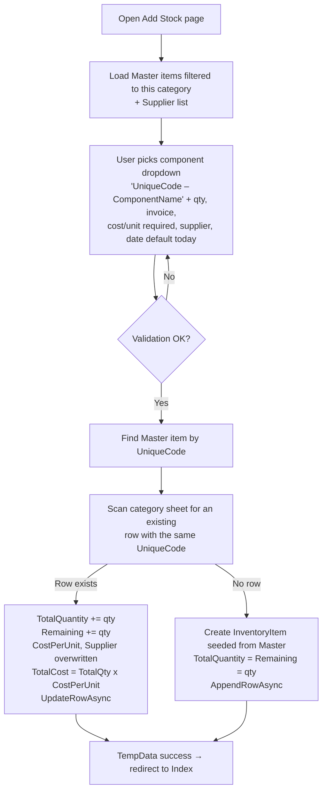
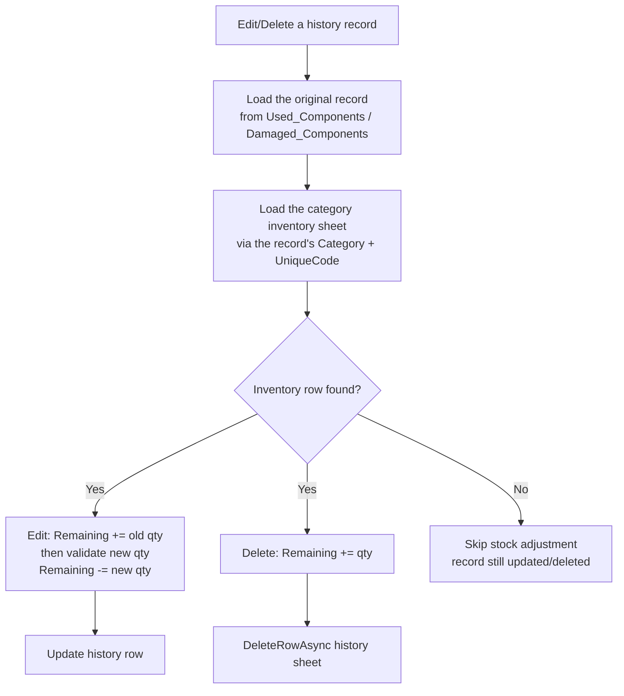

# Inventory Management System (GIMS v2.0) — Complete Technical Documentation

> **Companion to:** `SRD.md` (System Requirements Document, GIMS v2.0)
> **Codebase:** `Inventory_MS/` — ASP.NET Core Razor Pages, .NET 10, Google Sheets API v4
> **Status:** This document describes the system as built after the v2 transformation.

---

## Table of Contents

1. [System Overview](#1-system-overview)
2. [Architecture & Flow Charts](#2-architecture--flow-charts)
3. [Google Sheets — the Live Database](#3-google-sheets--the-live-database)
4. [How the Application Works — Module by Module](#4-how-the-application-works--module-by-module)
5. [Core Components Explained (SRD v2.0, paragraph-wise)](#5-core-components-explained-srd-v20-paragraph-wise)
6. [Conventions & Technical Rules](#6-conventions--technical-rules)
7. [Deployment on Google Cloud App Engine](#7-deployment-on-google-cloud-app-engine)
8. [Local Development](#8-local-development)
9. [Configuration Reference](#9-configuration-reference)

---

## 1. System Overview

The **General Inventory Management System (GIMS) v2.0** is an internal web
application for managing electronic components, electrical components, tools
& instruments, and modules. It is a *read/write* app — there is no sales or
billing; it tracks **purchases (stock in), usage (stock out), and damage
(stock out)**.

The application has **no traditional database**. A **Google Spreadsheet is the
live database**, accessed through the **Google Sheets API v4**. The server-side
application (ASP.NET Core Razor Pages) reads rows from the spreadsheet, parses
them into C# models, performs all business logic (stock math, validation,
rollback) in memory, and writes changes back as physical rows.

Key architectural decisions:

- **One spreadsheet, eight tabs** — each tab is a logical "table". Rows are
  **append-only**; the application **sorts in memory** before displaying
  (physical order in the sheet is irrelevant).
- **No SQL, no ORM** — every read is `GET {sheet}!A1:Z1000`, every write is an
  append, an update of a row range, or a physical row deletion.
- **Single generic inventory model** — all four category sheets share the
  exact same 11-column layout, so one C# model (`InventoryItem`) serves all of
  them. The sheet name is the only thing that differs.
- **Consistency by rollback** — stock deductions (usage/damage) happen *before*
  the history record is written. If the history write fails, the deduction is
  rolled back so the two sheets never drift apart.
- **No authentication layer** — the app is meant for internal use. Access
  control is a deployment concern (IAP), not an application concern.

---

## 2. Architecture & Flow Charts

### 2.1 High-Level Architecture

```mermaid
flowchart LR
    User[Browser] -->|HTTPS| LB[App Engine Load Balancer<br/>(terminates TLS)]
    LB -->|Plain HTTP + X-Forwarded headers| AE[App Engine Standard<br/>ASP.NET Core instance]
    AE -->|HTTPS + OAuth2 token| SHEETS[Google Sheets API v4]
    SHEETS -->|Spreadsheet ID| SP[(Google Spreadsheet<br/>the database)]
    SP -->|tabs| T1[Master]
    SP -->|tabs| T2[Suppliers]
    SP -->|tabs| T3[Electronics_Inventory]
    SP -->|tabs| T4[Electrical_Inventory]
    SP -->|tabs| T5[Tools_Inventory]
    SP -->|tabs| T6[Modules_Inventory]
    SP -->|tabs| T7[Used_Components]
    SP -->|tabs| T8[Damaged_Components]
    SA[Service Account key JSON] -.->|credential| AE
    SA -.->|shares the spreadsheet as Editor| SP
```

**The request lifecycle:**

1. The browser calls a page URL (`/ElectronicsInventory/Index`, `/Usage/Report`, …).
2. App Engine's load balancer terminates HTTPS and forwards the request to the
   ASP.NET Core instance with `X-Forwarded-*` headers. The app trusts these
   (`UseForwardedHeaders`) so scheme-aware redirects work correctly.
3. Razor Pages routing (`MapRazorPages`) dispatches to the page model
   (`.cshtml.cs`). Every page model **constructor-injects the singleton
   `GoogleSheetsService`**.
4. The page model calls `GetRowsAsync(sheetName)` → the service builds a
   signed OAuth2 request using the service-account credential → Sheets API
   returns `IList<IList<object>>` (raw cells) → the page model parses rows into
   typed models (`MasterItem`, `InventoryItem`, …) via `FromRow`.
5. The page model applies business logic (sorting, stock math, validation)
   and re-renders the Razor view, or performs writes (`AppendRowAsync`,
   `UpdateRowAsync`, `DeleteRowAsync`) and redirects with a `TempData["Success"]`
   message.

### 2.2 Page / Navigation Map

```mermaid
flowchart TD
    HOME[Home / Dashboard] --> MASTER[Master List]
    HOME --> ELEC[Electronics Inventory]
    HOME --> ELCT[Electrical Inventory]
    HOME --> TOOLS[Tools & Instruments Inventory]
    HOME --> MODS[Modules Inventory]
    HOME --> UR[Report Usage]
    HOME --> DR[Report Damage]

    MASTER --> M_CREATE[Create Master Item]
    MASTER --> M_EDIT[Edit Master Item]
    MASTER --> M_DEL[Delete Master Item]

    ELEC --> E_ADD[Add Stock – Electronics]
    ELEC --> E_EDIT[Edit Item]
    ELEC --> E_DEL[Delete Item]
    ELCT --> EL_ADD[Add Stock – Electrical]
    ELCT --> EL_EDIT[Edit Item]
    ELCT --> EL_DEL[Delete Item]
    TOOLS --> T_ADD[Add Stock – Tools]
    TOOLS --> T_EDIT[Edit Item]
    TOOLS --> T_DEL[Delete Item]
    MODS --> MO_ADD[Add Stock – Modules]
    MODS --> MO_EDIT[Edit Item]
    MODS --> MO_DEL[Delete Item]

    UR --> UH[Usage History]
    UH --> UE[Edit Usage Record]
    UH --> UD[Delete Usage Record]

    DR --> DH[Damage History]
    DH --> DE[Edit Damage Record]
    DH --> DD[Delete Damage Record]
```



*Note: the four category inventory folders are structurally identical — same
pages, same logic, only the sheet name differs.*

### 2.3 Business Flow — Add Stock



### 2.4 Business Flow — Report Usage (with rollback)

```mermaid
flowchart TD
    A[Open Report Usage] --> B[Load all 4 category sheets in parallel<br/>keep items with Remaining > 0, grouped by category]
    B --> C[User picks category + component<br/>(remaining shown as hint), qty, date, remarks]
    C --> D{ModelState valid?}
    D -->|No| C
    D -->|Yes| E{QuantityUsed <= Remaining?}
    E -->|No| F[Show 'Only N units in stock' error]
    E -->|Yes| G[Save original row snapshot]
    G --> H[Remaining -= QuantityUsed<br/>UpdateRowAsync category sheet]
    H --> I[Build UsedItem record<br/>BatchPurchaseDate = row's DateOfPurchase]
    I --> J[AppendRowAsync Used_Components]
    J -->|fails| K[Rollback: restore original row<br/>UpdateRowAsync]
    J -->|succeeds| L[TempData success → redirect to Usage History]
```

The **Report Damage** flow is identical, except it writes to
`Damaged_Components` with extra optional fields (Invoice No., Cost per Unit)
and the stock check uses `QuantityDamaged`.

### 2.5 Business Flow — History Edit / Delete (stock reversal)



---

## 3. Google Sheets — the Live Database

One spreadsheet, eight tabs. **Header row is row 1** in every tab. All columns
in the exact order below. Cells are read as raw objects; numbers come back as
`double`, empty trailing cells are omitted — every parse goes through safe
helpers (`SheetCell.SafeInt`, `SheetCell.SafeDecimal`, invariant culture).

### 3.1 `Master` — the central catalogue

| # | Column | Notes |
|---|---|---|
| A | UniqueCode | Auto-generated, e.g. `E-001`, `EL-014`, `T-003`, `M-002` |
| B | ComponentName | Primary display/sort key |
| C | Category | `Electronics` / `Electrical` / `Tools` / `Modules` |
| D | Brand | optional |
| E | Description | optional |
| F | Unit | e.g. `pcs`, `meters`, `sets` |
| G | MinStockAlert | Low-stock threshold used by the dashboard |

### 3.2 `Suppliers`

| # | Column |
|---|---|
| A | SupplierName |
| B | ContactInfo (optional) |

### 3.3 Category sheets — `Electronics_Inventory`, `Electrical_Inventory`, `Tools_Inventory`, `Modules_Inventory`

Identical layout (one model: `InventoryItem`):

| # | Column | Notes |
|---|---|---|
| A | UniqueCode | foreign key → Master.A |
| B | ComponentName | display-only in edit (comes from Master) |
| C | Brand | display-only in edit |
| D | TotalQuantity | purchased quantity |
| E | Remaining | current stock (≤ TotalQuantity in practice) |
| F | InvoiceNo | |
| G | CostPerUnit | **tax-inclusive** |
| H | TotalCost | = TotalQuantity × CostPerUnit, rounded to 2 dp |
| I | Supplier | picked from the Suppliers sheet |
| J | DateOfPurchase | `yyyy-MM-dd` |
| K | Remarks | |

### 3.4 `Used_Components` — usage log

A | UniqueCode | B | ComponentName | C | Category | D | BatchPurchaseDate | E | UsedDate | F | QuantityUsed | G | Remarks

### 3.5 `Damaged_Components` — damage log

A | UniqueCode | B | ComponentName | C | Category | D | BatchPurchaseDate | E | DamageDate | F | QuantityDamaged | G | InvoiceNo | H | CostPerUnit | I | Remarks

---

## 4. How the Application Works — Module by Module

### 4.1 Home / Dashboard (`/Index`)

Reads the Master sheet and all four category sheets **in parallel**. Each sheet
failure degrades to an empty list (the dashboard never crashes). It computes:

- **MasterCount** — items in the Master sheet.
- **LowStockCount** — a lookup map `UniqueCode → MinStockAlert` is built from
  Master; then every inventory row across the four category sheets is checked:
  if its `Remaining < MinStockAlert`, it counts. Items with no Master entry are
  skipped.
- Per-category item counts.

The page renders stat cards (Master, Low Stock, and one per category) with
quick links into each inventory, plus shortcut buttons to Report Usage and
Report Damage.

### 4.2 Master List (CRUD) — `/Master/*`

- **Index** — all rows parsed into `MasterItem`, sorted alphabetically by
  `ComponentName` (case-insensitive). Table shows Unique Code, Component Name,
  Category, Brand, Min Stock Alert + Edit/Delete actions.
- **Create** — form fields: ComponentName (required), Category (dropdown:
  Electronics / Electrical / Tools / Modules, required), Brand, Unit,
  MinStockAlert (default 5), Description.
  **Unique code generation:** the category maps to a prefix (`E-`/`EL-`/`T-`/`M-`),
  the Master sheet is scanned for the highest numeric suffix already used with
  that prefix, and the new code is `prefix + (max + 1)` zero-padded to three
  digits (`E-001`, …). Then the row is appended.
- **Edit** — same form; UniqueCode is read-only (it is the join key to every
  other sheet, so it cannot change).
- **Delete** — confirmation page, then physical row deletion.

### 4.3 Suppliers (CRUD) — `/Suppliers/*`

Straightforward CRUD against the Suppliers sheet, sorted alphabetically by
SupplierName. Used everywhere a supplier dropdown appears (Add Stock, Edit).

### 4.4 Category Inventory — `/ElectronicsInventory/*`, `/ElectricalInventory/*`, `/ToolsInventory/*`, `/ModulesInventory/*`

Each folder has four pages; the four folders differ **only** in sheet name
(`Electronics_Inventory`, etc.):

- **Index** — all rows → `List<InventoryItem>`, sorted by ComponentName.
  Table: Unique Code, Component Name, Brand, Total Qty, Remaining, Cost/Unit,
  Total Cost, Supplier, Date, Remarks, Edit/Delete. **"+ Add Stock"** button.
- **Add Stock** (the only "create" path — stock is always added to a Master
  component):
  - Component dropdown populated from the **Master sheet filtered to this
    category**, displayed as `UniqueCode – ComponentName` (required).
  - Quantity (required, ≥ 1), Invoice No., **Cost per Unit (required, > 0)**,
    Supplier (dropdown from Suppliers sheet), Date of Purchase (defaults to
    today), Remarks.
  - **On post:** the Master item is resolved; the category sheet is scanned for
    a row with the same UniqueCode.
    - **Found** → `TotalQuantity += qty`, `Remaining += qty`, `CostPerUnit` and
      `Supplier` overwritten with the new batch values, `TotalCost`
      recalculated, `UpdateRowAsync`.
    - **Not found** → a new `InventoryItem` is created (ComponentName/Brand
      seeded from Master, `TotalQuantity = Remaining = Quantity`),
      `AppendRowAsync`.
  - Redirect to Index with a `TempData` success message.
- **Edit** — UniqueCode, ComponentName, Brand are **display-only** (readonly
  inputs that still round-trip). TotalQuantity, Remaining, InvoiceNo,
  CostPerUnit, Supplier, DateOfPurchase, Remarks are editable independently.
  On save: `TotalCost = TotalQuantity × CostPerUnit` (rounded 2 dp) and the row
  is updated. There is no automatic reconciliation between TotalQuantity and
  Remaining — the user manages that (the sheet convention is
  `Remaining ≤ TotalQuantity`).
- **Delete** — confirmation page, physical row deletion. **No renumbering** —
  UniqueCode is a real identifier, not a sequence number.

### 4.5 Report Usage — `/Usage/Report`

- Category dropdown (Electronics / Electrical / Tools / Modules). All four
  category sheets are loaded in `OnGet` and the view renders **one select per
  category**, showing only items with `Remaining > 0`, labelled
  `UniqueCode – ComponentName (Remaining: N)`. A small JavaScript toggle shows
  the select of the chosen category and a hint line with available stock
  (client-side convenience; the real check is server-side).
- Fields: QuantityUsed (required, ≥ 1), UsedDate (defaults to today), Remarks.
- **On post (server-side validation, in order):**
  1. Map category → sheet name (`InventoryItem.SheetNameFor`); reject invalid.
  2. Re-load the category list fresh (so validation uses current stock).
  3. Find the item by UniqueCode; fail if gone.
  4. **Fail if `QuantityUsed > Remaining`** (with a message stating available
     stock).
  5. Snapshot the original row; `Remaining -= QuantityUsed`;
     `UpdateRowAsync`.
  6. Build the `UsedItem` (`BatchPurchaseDate` = the inventory row's
     `DateOfPurchase`) and `AppendRowAsync` to `Used_Components`.
  7. **If the append throws → restore the original row (rollback) and rethrow.**
  8. Success TempData → redirect to Usage History.

### 4.6 Usage History — `/Usage/History` (+ Edit / Delete)

- **History** — all rows from `Used_Components`, sorted by ComponentName
  (ascending), then **UsedDate descending**. Columns: Unique Code, Component
  Name, Category, Batch Purchase Date, Used Date, Qty Used, Remarks,
  Edit/Delete.
- **HistoryEdit** (`/Usage/HistoryEdit?id=N`) — edits UsedDate, QuantityUsed,
  Remarks only; the rest are display-only. **If the quantity changed:** the old
  quantity is added back to the inventory row (`Remaining += old`), then the
  new quantity is validated against the restored stock and deducted
  (`Remaining -= new`). If validation fails, nothing is written and an error is
  shown. If the inventory row no longer exists, the stock adjustment is skipped
  but the record is still saved.
- **HistoryDelete** — confirmation page. On confirm: `Remaining +=
  QuantityUsed` on the inventory row (if it still exists), then
  `DeleteRowAsync` the history row.

### 4.7 Report Damage — `/Damage/Report`

Identical mechanics to Report Usage (deduct → append with rollback), with:

- `QuantityDamaged` validated against `Remaining`.
- Extra **optional** fields: Invoice No. (falls back to the inventory row's
  invoice if blank) and Cost per Unit (falls back to the inventory row's unit
  cost if left at 0).
- Writes to `Damaged_Components`.

### 4.8 Damage History — `/Damage/History` (+ Edit / Delete)

Same as Usage History but for `Damaged_Components`; sort by ComponentName,
then **DamageDate descending**. Edit/Delete reverse the stock exactly like the
usage pages.

---

## 5. Core Components Explained (SRD v2.0, paragraph-wise)

This section walks through the SRD's core modules and explains, for each one,
what it requires and exactly how the codebase delivers it.

### 5.1 Dashboard

**SRD:** an at-a-glance summary of inventory health — total items, low-stock
alerts, stock value.

**Implementation:** `Pages/IndexModel` fires five `GetRowsAsync` calls in
parallel (Master + four category sheets). From the Master rows it builds a
`Dictionary<UniqueCode, MinStockAlert>`; every inventory row in every category
sheet whose `Remaining < MinStockAlert` increments `LowStockCount`. That single
number is the SRD's "low-stock alert", computed live on every page load — no
background jobs, no cached values, so it can never go stale. The dashboard also
counts Master items and per-category items, and the view turns these into
Bootstrap cards with links. One SRD nuance: the SRD also mentions *total stock
value*; the per-category sheets store `TotalCost` per row, so the data for a
sum already exists — a future enhancement can add `Σ TotalCost` to the
dashboard without touching the schema.

### 5.2 Product Management (Master)

**SRD:** central catalogue of all items — unique code, name, category, brand,
description.

**Implementation:** `MasterItem` maps to the `Master` tab. Its `FromRow`/`ToRow`
pair is the boundary: `FromRow` turns raw sheet cells into a typed object using
the invariant-culture safe parsers (`SheetCell`), `ToRow` produces the exact
7-cell list that `AppendRowAsync`/`UpdateRowAsync` write back — this keeps
column-order mistakes impossible to introduce silently. The UniqueCode is the
SRD's "unique code": generated on Create from a per-category prefix plus the
highest existing suffix + 1 (padded to 3 digits), and treated as **immutable**
thereafter (read-only in Edit) because it is the foreign key joining Master to
every category sheet, the usage log, and the damage log. Everything else
(ComponentName, Category, Brand, Description, Unit, MinStockAlert) is freely
editable. Delete is a confirmed physical row removal.

### 5.3 Category Management

**SRD:** grouping items into logical types; deliberately *no separate Category
sheet* — category is a column in Master.

**Implementation:** the SRD's design decision is honored exactly. The four
category names are constants on `InventoryItem` (`Electronics`, `Electrical`,
`Tools`, `Modules`), and two static mappers concentrate all the category
knowledge in one place: `SheetNameFor(category)` (→ `Electronics_Inventory`,
…) and `CodePrefixFor(category)` (→ `E-`, `EL-`, `T-`, `M-`). Every page that
needs category logic — Master Create (code generation), the four Add Stock
pages (Master filtering), Usage/Damage reports (sheet resolution) — goes
through these two methods, so a future fifth category is a two-line change in
one file plus a new sheet tab.

### 5.4 Supplier Management

**SRD:** list of approved suppliers; dropdowns elsewhere validated against
this list.

**Implementation:** the `Suppliers` tab + `Supplier` model (SupplierName,
ContactInfo) with full CRUD, sorted by name. Add Stock and inventory Edit both
populate their supplier dropdown from this sheet. The SRD says fields "use
dropdowns validated against this list" — the Edit page is deliberately
defensive here: if an existing inventory row references a supplier that was
since deleted from the Suppliers sheet, that name is injected back into the
dropdown options so the row can still be saved without silently losing data.
The app does **not** hard-reject an unknown supplier string on save (records
may predate the dropdown), but the UI never offers one.

### 5.5 Inventory / Stock Management

**SRD:** tracking quantities across category sheets and all movements (in,
out, damaged).

**Implementation:** the heart of the system is the write path, not the schema.
Every stock mutation is a **read-modify-write** against the row's physical
index (`RowIndex`, 1-based, header included):
`Remaining` is decremented only after a server-side availability check, and the
*new* stock values are written back through `UpdateRowAsync` with the *same*
row address used for the read — no offsets, no lookups by name. Stock *in* is
Add Stock (increment + cost/supplier overwrite); stock *out* is Usage and
Damage reports. Because Add Stock guarantees **at most one row per
UniqueCode** in a category sheet (found → update, missing → append), all
later lookups (usage, damage, history rollback) can safely locate a row by
UniqueCode alone. Physical deletion of inventory rows is allowed but history
rollbacks handle the case where the row is gone.

### 5.6 Transaction History

**SRD:** audit trail of all stock reductions, with edit/delete and rollback.

**Implementation:** two append-only logs: `Used_Components` (`UsedItem`) and
`Damaged_Components` (`DamagedItem`). Each record is a **self-contained
snapshot**: UniqueCode, ComponentName, Category, BatchPurchaseDate (copied from
the inventory row at the time of the movement), the movement date, and the
quantity. Because the record carries its own Category and UniqueCode, an edit
or delete can locate the source inventory row *without* any join machinery.
The rollback protocol is two-sided: (a) **write-side** — if appending the log
record fails after the stock was deducted, the original row bytes are restored;
(b) **history-edit/delete-side** — quantities are added back to stock before
the new quantity is re-deducted (edit) or the record is removed (delete),
always validated against the restored stock level. This satisfies the SRD's
"audit trail" requirement while keeping the two sheets consistent by
construction.

### 5.7 Supporting infrastructure (not modules, but load-bearing)

- **`GoogleSheetsService`** (singleton) — the only class allowed to touch the
  Sheets API. It serializes every write with a `SemaphoreSlim` (so concurrent
  requests can never interleave a read-modify-write), caches tab IDs for row
  deletion, and exposes five operations: `GetRowsAsync` (read all), 
  `AppendRowAsync` (returns the new 1-based row index), `UpdateRowAsync`
  (overwrite a row range), `DeleteRowAsync` (physical `DeleteDimension`
  removal — deliberately **no** renumbering, since column A is UniqueCode, not
  Sl.No.), and `GetCellValueAsync`. Page models never build Sheets requests
  themselves.
- **Models layer** — pure POCOs with `FromRow`/`ToRow`, `[Display]` labels and
  `[Range]`/`[Required]` validation attributes. `InventoryItem.RecalculateCosts()`
  is the *only* cost formula in the system (tax-inclusive:
  `TotalCost = Round(TotalQuantity × CostPerUnit, 2)`), per the SRD's "no GST"
  decision.
- **Page models + views** — constructor injection everywhere; `OnGet` loads,
  `OnPost` validates (`ModelState`) then writes then redirects with
  `TempData["Success"]`; every `FindAsync` guards against stale row indexes.
- **Rollback helpers** — `Fail(message)` adds a model error and re-renders;
  the usage/damage report flows snapshot `item.ToRow()` before mutating and
  restore it in a `catch`.

---

## 6. Conventions & Technical Rules

- **Row indexes are 1-based and include the header** (row 1 = header). A row
  at list position `i` (0-based, skipping the header) lives at index `i + 1`.
- **Dates** are stored and displayed as `yyyy-MM-dd` strings; date inputs
  default to today.
- **Money** is `decimal`, formatted `₹ N2` with `InvariantCulture`; parsing is
  `InvariantCulture` (`NumberStyles.Any`).
- **Sorting** happens only in page models (LINQ `OrderBy`), never in the
  service, never in the sheet.
- **Sheet names (exact):** `Master`, `Suppliers`, `Electronics_Inventory`,
  `Electrical_Inventory`, `Tools_Inventory`, `Modules_Inventory`,
  `Used_Components`, `Damaged_Components`. The old tabs (`PCB_Inventory`,
  `Panel_Inventory`, `Damages_Components`) must be removed/replaced.
- **UniqueCode prefixes:** `E-` Electronics, `EL-` Electrical, `T-` Tools,
  `M-` Modules; numeric suffix zero-padded to 3 digits.
- **One row per UniqueCode per category sheet** (enforced by Add Stock).
- **Nullable reference types and implicit usings are enabled**; the project
  targets `net10.0`.

---

## 7. Deployment on Google Cloud App Engine

> Note: the checked-in `app.yaml` is **out of date** and is being reworked as
> part of the current deployment effort. The *interaction model* below is what
> the code requires; exact file paths/secret ids must match whatever the new
> `app.yaml` declares.

### 7.1 The actors and how they relate

```
GCP Project
├── App Engine (Standard, aspnetcore runtime)   ← runs the .NET app
├── Service Account "inventory-sa"              ← machine identity
│   ├── JSON key  → stored in Secret Manager  → mounted as a volume
│   └── email     → added as EDITOR on the Google Spreadsheet
└── Secret Manager "SERVICE_ACCOUNT_KEY"        ← holds the key JSON
```

1. **You** create a service account in Google Cloud (IAM & Admin → Service
   Accounts) and download its **JSON key**. This key is a machine identity:
   it contains a private key that lets the app sign requests as that
   service account.
2. **You** share the spreadsheet with the **service-account email address**
   as **Editor** (spreadsheet → Share → paste `inventory-sa@<project>.iam.gserviceaccount.com`).
   This is the single most common deployment failure: the app code is correct
   but the sheet's ACL doesn't include the service account, so every read
   returns 403.
3. **You** store the key JSON in **Secret Manager** as a secret
   (e.g. `SERVICE_ACCOUNT_KEY`), so the key never lives in the repo.
4. **App Engine** mounts the secret as a **read-only volume** (see `app.yaml`:
   `secret_volumes` + `volume_mounts`, e.g. mounted at `/var/secrets/google`).
   Files inside a secret volume are named after the **secret id**.
5. The app reads the mounted path from the **`GOOGLE_APPLICATION_CREDENTIALS`**
   environment variable (set in `app.yaml` `env_variables`).
6. At startup, `Program.cs` also reads **`SpreadsheetId`** (env var first, then
   config) and **throws if it is missing** — the app refuses to boot without
   knowing which spreadsheet to use.
7. `GoogleSheetsService.LoadCredential()` resolves the credential:
   - **If `GOOGLE_APPLICATION_CREDENTIALS` points to a file that exists** →
     `GoogleCredential.FromFile(path).CreateScoped(SheetsService.Scope.Spreadsheets)`
     (i.e. "act as this service account").
   - **Otherwise** → Application Default Credentials
     (`GetApplicationDefaultAsync()`), which on App Engine is the project's
     **default App Engine service account** automatically. This is the fallback
     that lets the app run even without an explicit key mount.
8. Every Sheets call is then an HTTPS request **signed with an OAuth2 token
   minted from that key**, targeting `SheetsService.Scope.Spreadsheets`
   (`https://www.googleapis.com/auth/spreadsheets`), addressed by the
   `SpreadsheetId`.

### 7.2 Why App Engine (Standard, aspnetcore) works here

- The app is a stateless web frontend + a thin API client; App Engine Standard
  scales instances from zero, fits the free-tier budget, and terminates TLS at
  the load balancer. The app is configured to trust the forwarded headers
  (`X-Forwarded-Proto`, `X-Forwarded-For`) so `UseHttpsRedirection` and
  scheme-aware redirects behave in production (`Program.cs` clears the known
  proxy lists — on App Engine the load balancer IPs are dynamic).
- In production, unhandled exceptions go to `/Error` (`UseExceptionHandler`).
- `ASPNETCORE_ENVIRONMENT=Production` is set in `app.yaml`.

### 7.3 Prerequisites (one-time)

```powershell
# 0) gcloud auth login + set the project
gcloud config set project <PROJECT_ID>

# 1) Create the secret from your downloaded key (if not already done)
gcloud secrets create SERVICE_ACCOUNT_KEY --data-file=service-account-key.json

# 2) Grant the App Engine default service account read access to the secret
gcloud secrets add-iam-policy-binding SERVICE_ACCOUNT_KEY `
  --member="serviceAccount:<PROJECT_ID>@appspot.gserviceaccount.com" `
  --role="roles/secretmanager.secretAccessor"
```

### 7.4 The app.yaml contract (what the code expects)

Whatever the new `app.yaml` ends up as, it must provide:

| Requirement | How the code consumes it |
|---|---|
| `SpreadsheetId` env var | `Program.cs` → `builder.Configuration`; boot fails without it |
| `GOOGLE_APPLICATION_CREDENTIALS` env var | points to the mounted secret file; if unset/unfound → ADC fallback |
| Secret volume mount + read access | `LoadCredential` uses `File.Exists` on the path |
| The spreadsheet shared with the key's service-account email (Editor) | every `GetRowsAsync`/write would 403 otherwise |

Suggested shape (adjust secret id / mount path to your new file):

```yaml
runtime: aspnetcore
env: standard
instance_class: B1

secret_volumes:
  - mount_path: /var/secrets/google
    name: service-account-key
    secret_id: SERVICE_ACCOUNT_KEY
    version: latest

env_variables:
  SpreadsheetId: "<YOUR_SPREADSHEET_ID>"
  ASPNETCORE_ENVIRONMENT: "Production"
  GOOGLE_APPLICATION_CREDENTIALS: "/var/secrets/google/SERVICE_ACCOUNT_KEY"
```

> Files inside a secret volume are named after the **secret id** — if your
> secret is not named `SERVICE_ACCOUNT_KEY`, the credentials path must match.

### 7.5 Deploy

```powershell
cd C:\e\Projects\Inventory_Management\Inventory_MS
gcloud app deploy app.yaml
gcloud app browse        # open the deployed URL
```

Deployment notes:

- `gcloud app deploy` uploads the source directory; `bin/`, `obj/` should be
  excluded (`.gcloudignore` / `.gitignore`).
- If you change only config, `gcloud app deploy --no-promote` lets you smoke
  test a new version before routing traffic.
- **Access control:** the app has no login. If the deployed URL is publicly
  reachable, protect it with **Identity-Aware Proxy (IAP)** before going live,
  or restrict App Engine traffic to your network.
- **Troubleshooting matrix:**
  - *403 "The caller does not have permission"* → spreadsheet not shared with
    the service account (or wrong service account key mounted).
  - *"Tab 'X' was not found"* → the spreadsheet still has old tab names;
    rename/create the eight tabs exactly.
  - *Boot exception "SpreadsheetId is not configured"* → env var missing from
    `app.yaml`.
  - *Secrets mount fails* → the App Engine service account lacks
    `roles/secretmanager.secretAccessor` (step 7.3).

---

## 8. Local Development

```powershell
cd C:\e\Projects\Inventory_Management\Inventory_MS\Inventory_MS

# Point the app at your spreadsheet (dev machine only)
dotnet user-secrets set SpreadsheetId "<spreadsheet-id>"

# Credentials: either an env var pointing at the downloaded key, or ADC
$env:GOOGLE_APPLICATION_CREDENTIALS = "C:\path\to\service-account-key.json"
# or: gcloud auth application-default login

dotnet run
```

The same credential-resolution logic applies locally: if the key file exists
at the configured path it is used; otherwise ADC is used. The spreadsheet must
still be shared with whatever identity the app authenticates as (service
account email, or your own Google account via ADC).

---

## 9. Configuration Reference

| Key | Source | Required | Used for |
|---|---|---|---|
| `SpreadsheetId` | env var → appsettings.json → User Secrets | Yes (boot fails without it) | addressing the spreadsheet in every Sheets call |
| `GOOGLE_APPLICATION_CREDENTIALS` | env var → appsettings.json | No (ADC fallback) | path to the service-account JSON key |
| `ASPNETCORE_ENVIRONMENT` | env var / app.yaml | Recommended | Production error handling |

The service is registered once in `Program.cs`:
`AddSingleton(new GoogleSheetsService(spreadsheetId, credentialsPath ?? ""))`
— a single instance is shared by all requests, which is also why the service
serializes writes with its internal lock.
